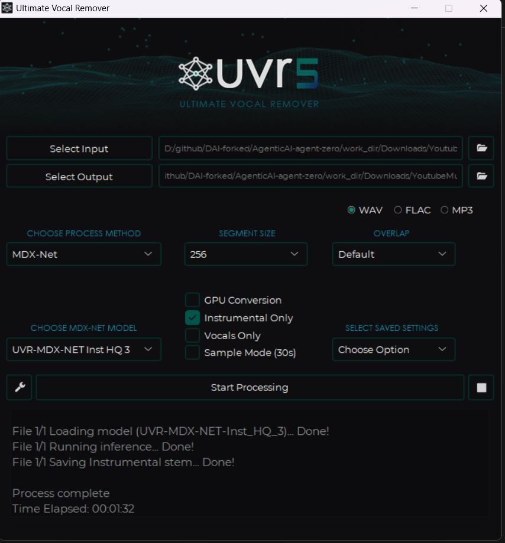
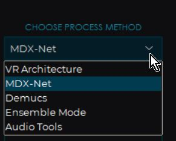
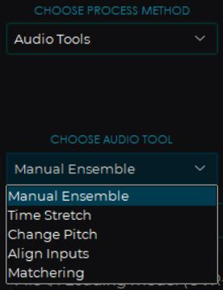
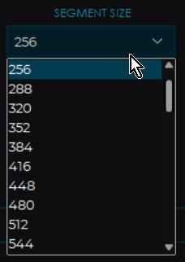

# Readme

## Objective
We need to separate voice and audio from a given audio 

## Experiments 
To seprate voice and music from an audio.
- tried github 
	- https://github.com/Anjok07/ultimatevocalremovergui
	- pip install -r requiments.txt failed on defaul python312
	- tried even with python 3.9.13 (most stable version of the time when this package was last updated). pip install -r requiments.txt failed.
	- **<font color=red>Results failed - because of dependencies issues. Tried multiple options nothing worked.</font>**
- attempted with agent-zero
	- https://github.com/frdel/agent-zero
	- Even after many prompt, no success. Because of package dependency issues.
	- tried following libraries: Spleeter, Audacity
	- **<font color=red>Results failed</font>
- tried ffmpeg 
	- Basic Command to Remove Audio
	```
	ffmpeg -i input.mp4 -c:v copy -an output.mp4
	```
	- Advanced Vocal Removal
	```
	ffmpeg -i input.mp4 -vn audio.wav
	```
		- Spleeter - library is failing.
	- **<font color=red>Results failed</font>
- tried windows app - uvr5 (ultimate vocal removal)
	- https://github.com/Anjok07/ultimatevocalremovergui/releases/download/v5.6/UVR_v5.6.0_setup.exe
	- it worked.
	- this app as different models.
	- I got fairly good result with MDS-Net (processing method) and URV-MDX-NET-Inst-HQ3 (model). To have better quality this tool can be tried.
	- This is free tool.
	- **<font color=green>Results  - This solution worked</font>**




